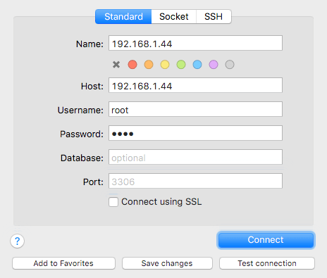

# mysql-vagrant

mysql-vagrant is a quick way to run mysql locally for development without an ssh tunnel

### Start server

     $ vagrant up

### Connect to mysql:

- host: 192.168.1.44 (or mysql-server.local if you update your hosts file)
- username: root
- password: root

### From sequel pro

### Warning

For development use only, do not use in production.

### License

MIT
